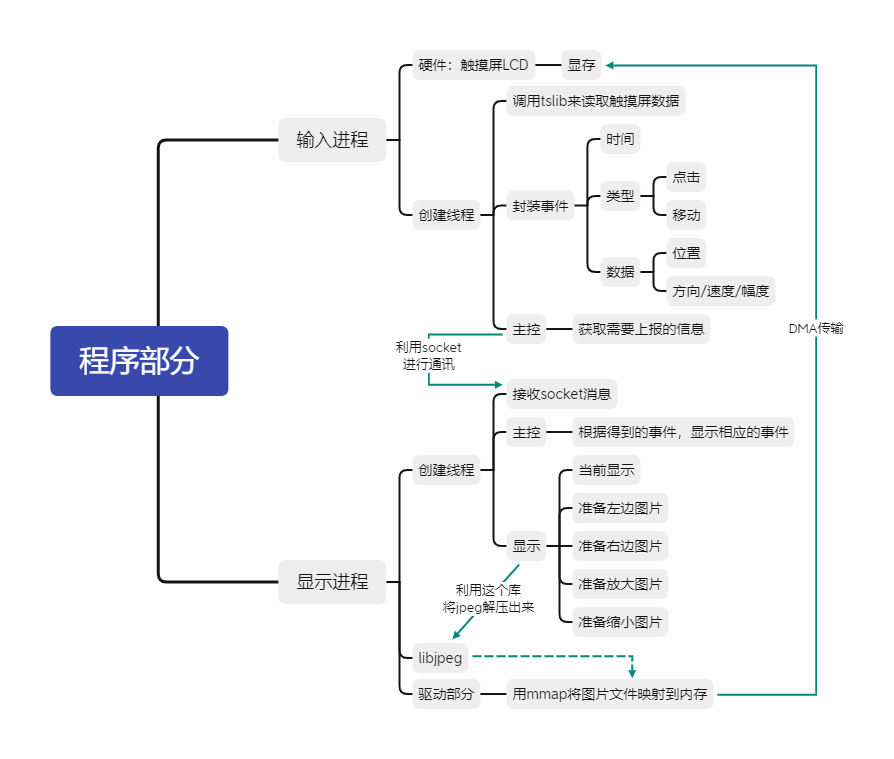

# 数码相框
## 软件需求
1. 上电后LCD可以显示一张图片
2. 根据配置文件，决定软件是停留在该图片还是自动显示到下一幅
3. 点击图片后会出现对话框：对话框内容会显示图片的显示模式（手动显示或者自动显示）
4. 在屏幕上，往左边划动是下一幅图片，往右边划动是上一幅图片，往上划动是放大图片，往下划动是缩小图片
## 程序部分
- 程序部分导图

- 注意：开一个内存不建议使用malloc，可以用mmap来对jpeg解压后的文件进行映射
